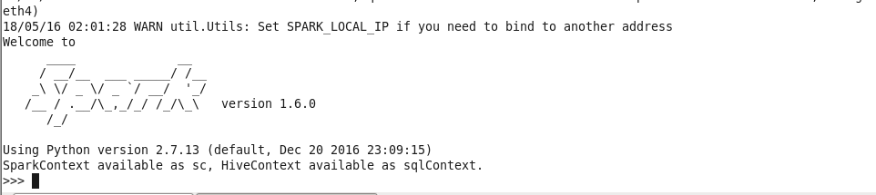

## PySpark

### Introduction

- Apache Spark is written in Scala programming language. To support Python with Spark, Apache Spark Community released a tool, PySpark. 
- Using PySpark, you can work with RDDs in Python programming language also.
- PySpark offers PySpark Shell which links the Python API to the spark core and initializes the Spark context.
- Majority of data scientists and analytics experts today use Python because of its rich library set.

### Setup

1. Go to [Apache Spark](https://spark.apache.org/downloads.html) and download latest tar file
2. Extract it ``spark-2.3.0-bin-hadoop2.7.tgz
3. Set the Path
```
export SPARK_HOME = /home/hadoop/spark-2.1.0-bin-hadoop2.7
export PATH = $PATH:/home/hadoop/spark-2.1.0-bin-hadoop2.7/bin
export PYTHONPATH = $SPARK_HOME/python:$SPARK_HOME/python/lib/py4j-0.10.4-src.zip:$PYTHONPATH
export PATH = $SPARK_HOME/python:$PATH
```
4. Start Spark Shell `./bin/pyspark`
   

(OR)

1. Setup VM using [cloudera]((https://www.cloudera.com/downloads/quickstart_vms/5-13.html) quickstart images {All installations came with the image}


#### Start Pyspark with Jupytor
1. Set the Path
```
export PYSPARK_DRIVER_PYTHON=/usr/local/bin/jupyter
export PYSPARK_DRIVER_PYTHON_OPTS="notebook --NotebookApp.open_browser=False --NotebookApp.ip='*' --NotebookApp.port=8880"
export PYSPARK_PYTHON=/usr/bin/python
```
2. Run `pyspark` [It opens Jupytor Notebook]

### PySpark - RDD

- RDD stands for **Resilient Distributed Dataset**, these are the elements that run and operate on multiple nodes to do parallel processing on a cluster. 
- RDDs are immutable elements, which means once you create an RDD you cannot change it. 
- RDDs are fault tolerant as well, hence in case of any failure, they recover automatically. 
- You can apply multiple operations on these RDDs to achieve a certain task.
- RDD's operations are there are two ways −
    - **Transformation** : These applied on a RDD to create a new RDD. Filter, groupBy and map are the examples of transformations.
    - **Action** :  These are the operations that are applied on RDD, which instructs Spark to perform computation and send the result back to the driver. eg: collect(), count()...
