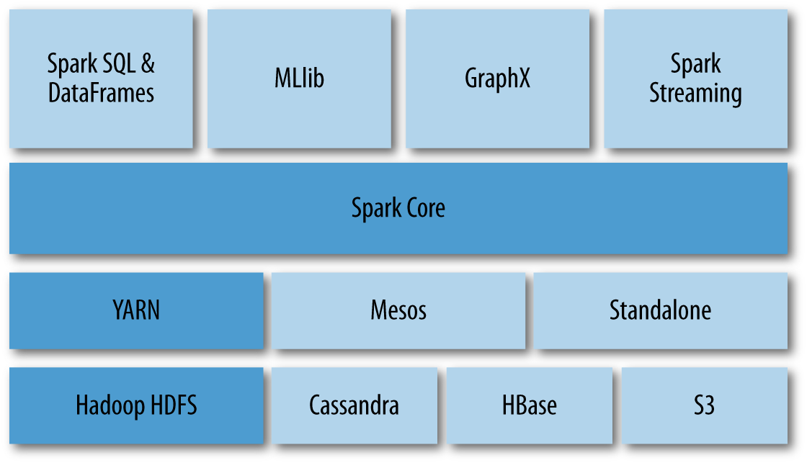

## Introduction

**Apache Spark** is a unified analytics engine for large-scale data processing.

## Setup
https://spark.apache.org/downloads.html

### Terminology

|Term |Description|
|-----|-----------|
|RDD  |Resilent Distributed Datasets|
|DAG  |Directed Acyclic Graph|
|LRU  |Least Recently Used+|

## Spark Eco System

## PySpark
- [Introduction](Introduction.md)
- [Examples](examples/)
- [Notebooks](notebooks/)

## References 
- [Apache Spark](https://spark.apache.org/)
- [Horton Networks](https://hortonworks.com/apache/spark/)
- [DataBricks](https://databricks.com/)
