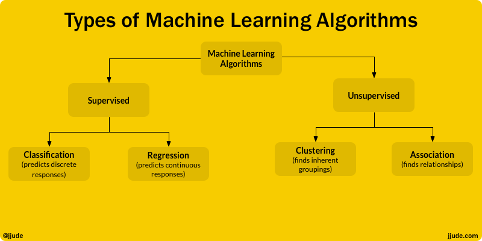
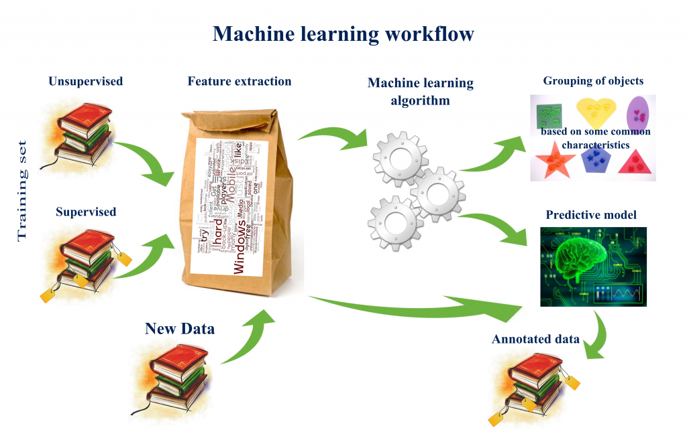
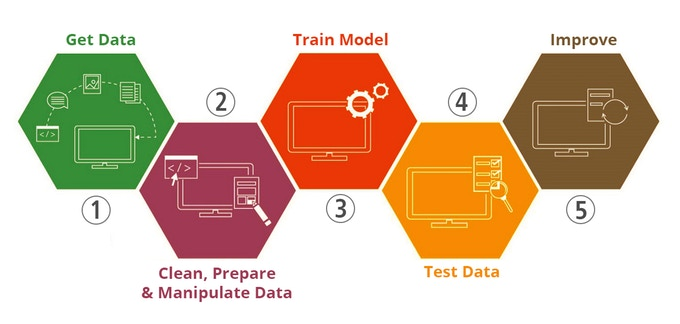

## Machine Leaning

### Introduction
- Machines imitating and adapting human like behavior.
- **Wikipedia** :"Machine learning is a field of computer science that often uses statistical techniques to give computer systems the ability to "learn" (e.g., progressively improve performance on a specific task) with data, without being explicitly programmed."

### Applications of ML
- Your personal Assistant Siri or Google uses ML.
- Weather predictions for the next week comes using ML.
- Win Predictor in a sports tournament uses ML.
- Medical Diagnosis dominantly uses ML.
- something you would be familiar with, ever wondered how come media sites shows you recommendations and ads matching closely to your interests.

### ML Types

### ML WorkFlow

### ML Process

### References
- [ML-Analyticsvidhya](https://www.analyticsvidhya.com/blog/2017/09/common-machine-learning-algorithms/)
